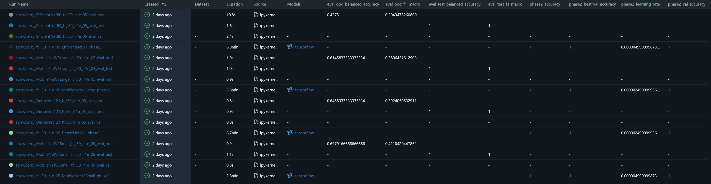
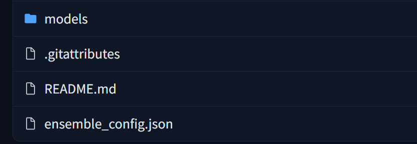
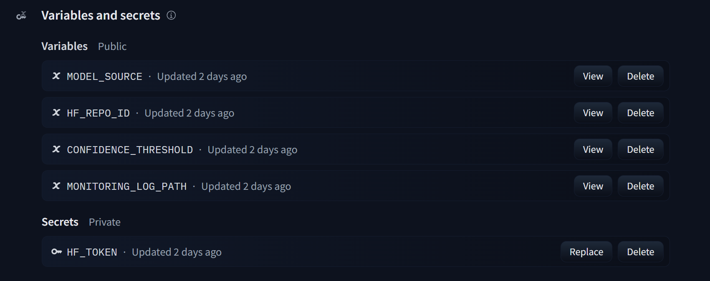
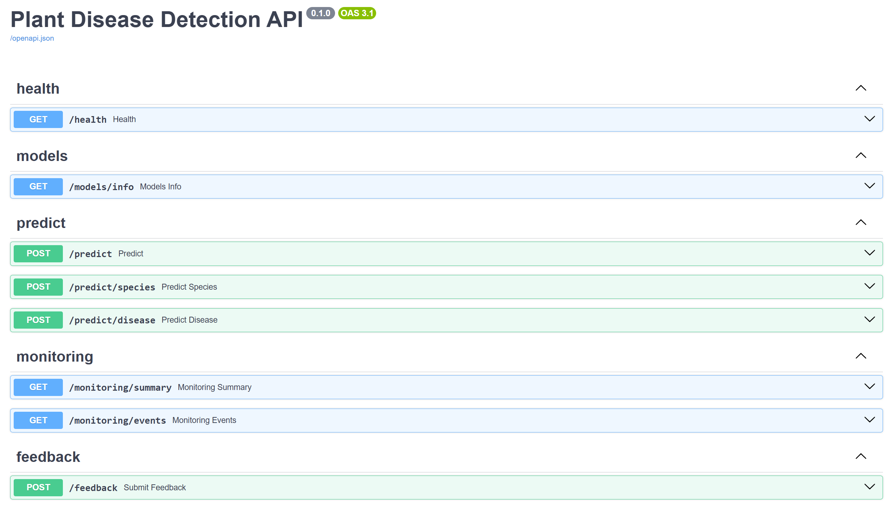

# Cas pratique

Cette partie du rapport professionnel couvre trois compétences évaluées : organiser une veille technique et réglementaire, identifier et benchmarker des services IA préexistants, puis paramétrer le service retenu.

---

## 1. Introduction et expression du besoin IA

### Contexte

Les maladies foliaires sont une cause fréquente de pertes agricoles. Un diagnostic précoce peut limiter leur propagation, mais il suppose une expertise terrain que tout utilisateur ne possède pas. Agriculteurs, techniciens agricoles, étudiants ou porteurs de projets agritech ont intérêt à disposer d'un premier outil d'orientation visuelle rapide, accessible sans formation spécialisée.

Le projet **Plant Disease Detection** répond à ce besoin : l'utilisateur envoie une image de feuille et obtient une première indication sur l'espèce végétale, la maladie associée et un score de confiance. Le système est présenté comme une **aide à l'interprétation**, pas comme un diagnostic agronomique certifié.

### Problème utilisateur

Trois difficultés concrètes rendent le problème non trivial :

- l'espèce n'est pas toujours connue ou renseignée par l'utilisateur ;
- les symptômes de maladies différentes sont visuellement proches ;
- les images terrain sont variables : fond, éclairage, angle, flou et occlusions diffèrent des images contrôlées utilisées pour l'entraînement.

Ce dernier point est documenté dans la littérature. PlantVillage constitue un dataset de référence largement utilisé pour le diagnostic foliaire par image ([TensorFlow Datasets][1]), mais il contient des images prises dans des conditions relativement contrôlées, ce qui peut favoriser des biais visuels et limiter la généralisation à des images terrain. PlantDoc ([arXiv 1911.10317][2]) propose des images plus proches des conditions réelles. Une analyse des biais de PlantVillage ([arXiv 2206.04374][3]) confirme que la performance mesurée sur ce dataset surestime les capacités réelles du modèle hors distribution.

### Fonctionnalités IA attendues

Le système doit répondre à sept fonctionnalités :

- détection de l'espèce végétale depuis une image ;
- diagnostic de la maladie associée si l'espèce est couverte ;
- score de confiance affiché comme indicateur d'aide à la lecture ;
- API FastAPI d'inférence ;
- interface Streamlit permettant l'upload et la lecture du résultat ;
- traçabilité des expérimentations via MLflow/DagsHub ;
- publication des artefacts sur Hugging Face Hub et déploiement de l'API/interface sur Hugging Face Spaces.

### Schéma du besoin

```text
Image de feuille
  → classification espèce
      → classification maladie
          → réponse utilisateur (espèce, maladie, confiance)
```

### Contraintes et implications techniques

| Besoin | Contrainte | Implication technique |
|---|---|---|
| Identifier la maladie depuis une image | L'utilisateur ne connaît pas toujours l'espèce | Pipeline en deux étapes : espèce puis maladie |
| Obtenir une réponse rapide | Ressources matérielles et temps limités | Modèles pré-entraînés puis fine-tunés |
| Fournir un résultat compréhensible | Public non expert | Classe prédite, score de confiance et message de prudence |
| Déployer simplement | Projet individuel, budget minimal | Hugging Face Hub pour les artefacts, Spaces pour l'exposition |
| Comparer plusieurs essais | Plusieurs backbones et réglages testés | MLflow/DagsHub pour les runs, métriques et artefacts |
| Limiter la mauvaise généralisation | PlantVillage est un dataset contrôlé | Évaluation out-of-distribution sur PlantDoc |
| Limiter les risques sur les données | Confidentialité minimale | Secrets hors dépôt, logs sans stockage d'images |

Le rapport précise que le score de confiance ne doit pas être interprété comme une probabilité calibrée en l'absence d'étude spécifique de calibration.

---

## 2. Dispositif de veille technique et réglementaire

### Méthode

La veille a été organisée comme un processus de décision en quatre étapes : collecte des sources, qualification selon des critères explicites, analyse comparative, transformation en recommandation.

```text
Collecte → Qualification → Comparaison → Recommandation → Paramétrage
```

Les mots-clés utilisés pour la collecte couvrent les domaines technique et réglementaire : `plant disease detection transfer learning keras`, `PlantVillage PlantDoc out of distribution`, `keras applications mobilenet efficientnet convnext`, `hugging face docker spaces fastapi`, `mlflow tracking dagshub`, `gdpr image upload minimisation`, `ai act risk image classification`.

### Critères de sélection des sources

Cinq critères ont guidé la sélection : **autorité** de la source, **actualité** du contenu, **pertinence** pour le besoin IA, **vérifiabilité** des affirmations, **utilité** pour une décision ou un paramétrage concret. Un lien ou un article qui ne permet pas de trancher une question technique ou réglementaire n'est pas retenu.

### Organisation et capitalisation de la veille

Le projet a été réalisé individuellement. Pour répondre à l'exigence d'organisation collective, la veille a donc été structurée comme un dispositif partageable par une équipe projet : critères de sélection explicites, sources qualifiées, synthèses décisionnelles et liens entre information collectée et choix techniques. Cette organisation permettrait à un autre membre de reprendre la veille, de vérifier les sources, ou de poursuivre la mise à jour après livraison.

| Élément de veille | Support de capitalisation | Usage collectif possible |
|---|---|---|
| Sources techniques et réglementaires | Bibliographie commentée du rapport | Vérification et mise à jour des références |
| Critères de sélection | Tableau de qualification des sources | Arbitrage partagé des sources fiables |
| Synthèses technique et réglementaire | Tableaux de décision | Discussion des choix d'architecture |
| Benchmark des solutions | Grille comparative | Justification d'une recommandation projet |
| Décisions issues de la veille | Rapport et documentation projet | Transmission à une équipe de maintenance |

### Sources qualifiées

| Source | Type | Usage dans le rapport |
|---|---|---|
| TensorFlow / Keras | Documentation officielle | Transfer learning, architectures pré-entraînées |
| PlantVillage / PlantDoc | Datasets / publications | Besoin IA, limites terrain, évaluation OOD |
| Hugging Face Hub / Spaces | Documentation officielle | Stockage d'artefacts, déploiement Docker |
| MLflow / DagsHub | Documentation officielle | Suivi expérimental des entraînements |
| Vertex AI / AWS Rekognition / Azure Custom Vision / Roboflow | Documentation fournisseurs | Benchmark des services managés |
| Kindwise plant.health, Pl@ntNet diseases | Documentation API | Comparaison spécialisée métier |
| Commission européenne / EUR-Lex / CNIL / W3C | Sources officielles | RGPD, AI Act, accessibilité |

### Synthèse technique

Le transfer learning est adapté au projet : il permet d'exploiter des représentations visuelles apprises sur ImageNet sans repartir d'un entraînement from scratch, et réduit le coût de calcul par rapport à un entraînement complet depuis zéro ([Keras transfer learning][4]). Plusieurs familles de modèles TensorFlow/Keras ont été étudiées ([Keras Applications][5]).

| Famille | Intérêt | Limite | Décision |
|---|---|---|---|
| MobileNetV3 | Léger, utilisable CPU/web | Capacité parfois moindre | Benchmarké |
| EfficientNet B0/B1 | Bon ratio performance/coût | Plus lourd que MobileNet | Benchmarké |
| DenseNet121 | Backbone éprouvé | Moins léger | Benchmarké secondaire |
| ConvNeXtTiny | Convnet moderne performant | Plus coûteux en ressources | Benchmarké |
| Vision Transformers | État de l'art utile | Moins prioritaire pour ce projet | Veille seulement |
| Services AutoML cloud | Entraînement managé | Coût et dépendance fournisseur | Alternative documentaire |
| APIs spécialisées plante | Intégration rapide | Faible contrôle, taxonomie externe | Benchmark documentaire |

PlantVillage fournit la base d'entraînement principale, mais ses images relativement contrôlées ne représentent pas les conditions terrain. PlantDoc est utilisé comme jeu de test out-of-distribution pour mesurer l'écart de performance réel.



*Figure 1 - Runs MLflow/DagsHub utilisés pour comparer les architectures, les métriques in-distribution et les résultats out-of-distribution.*

### Synthèse réglementaire et éthique

| Point | Impact concret sur le projet | Preuve associée |
|---|---|---|
| RGPD — périmètre | Une image de feuille est a priori non personnelle, mais les métadonnées ou le contexte d'usage peuvent changer cette qualification | Note de périmètre dans le rapport |
| Minimisation des données | Les images ne sont pas stockées ; les logs JSONL ne stockent pas l'image brute et se limitent à des métadonnées techniques utiles au suivi : endpoint, statut, prédictions, confiances, latence, source des modèles | Extrait JSONL anonymisé |
| Sécurité des secrets | Les tokens Hugging Face et DagsHub sont hors dépôt Git | `.env.example`, captures Settings secrets |
| Transparence algorithmique | Le score de confiance est présenté comme un indicateur d'aide à la lecture, sans être interprété comme une probabilité calibrée | Capture Streamlit + formulation de prudence dans le rapport |
| Biais dataset | PlantVillage ne suffit pas pour évaluer la robustesse terrain | Résultats in-distribution vs OOD |
| Licences | Datasets et poids pré-entraînés ont des licences à vérifier | Sources documentées dans la bibliographie |
| Accessibilité | Interface lisible, messages d'erreur clairs, contrastes suffisants | Checklist UI ([WCAG 2.2][16]) |
| AI Act | Prudence requise, pas d'affirmation juridique catégorique | Formulation prudente |

Cette approche s'appuie sur les principes de minimisation du RGPD et les recommandations de la CNIL sur les systèmes d'IA ([Commission européenne][13], [CNIL][15]). L'accessibilité de l'interface est encadrée par les WCAG 2.2 ([WCAG 2.2][16]).

Sur le règlement européen sur l'IA ([EUR-Lex 2024/1689][14]) : une application de classification d'images de feuilles à visée d'aide au diagnostic agricole, non médicale, non biométrique et sans rôle de composant de sécurité d'un produit réglementé, ne semble pas relever a priori d'une catégorie à haut risque standard. Cette qualification dépend toutefois du contexte exact d'usage et ne constitue pas une analyse juridique.

### Décisions issues de la veille

La veille n'a pas seulement servi à documenter le contexte : elle a directement orienté plusieurs décisions techniques, réglementaires et produit.

| Information issue de la veille | Décision projet |
|---|---|
| PlantVillage est un dataset contrôlé qui peut surestimer les performances terrain | Ajout d'une évaluation out-of-distribution avec PlantDoc |
| Les modèles de classification produisent un score de confiance non calibré par défaut | Affichage du score comme indicateur, sans le présenter comme une probabilité certaine |
| Les images et métadonnées peuvent devenir sensibles selon le contexte d'usage | Absence de stockage des images brutes dans les logs de monitoring |
| Les services AutoML réduisent l'effort d'intégration mais limitent le contrôle sur les architectures et les artefacts | Choix d'une stack custom TensorFlow/Keras, Hugging Face Hub/Spaces et MLflow/DagsHub |
| Les plateformes cloud nécessitent une gestion stricte des identifiants d'accès | Utilisation de variables d'environnement et de secrets Hugging Face, sans token commité |
| Les interfaces d'aide à la décision doivent rester compréhensibles pour un public non expert | Messages de prudence, résultats lisibles et erreurs explicites dans l'interface |

---

## 3. Inventaire des services IA préexistants

L'inventaire couvre cinq catégories de solutions accessibles pour répondre au besoin IA.

| Type | Services identifiés | Caractéristiques |
|---|---|---|
| Bibliothèques open-source | TensorFlow/Keras, Keras Applications | Contrôle fort, fine-tuning, ingénierie nécessaire |
| Services AutoML cloud | Vertex AI AutoML Vision, Azure AI Custom Vision, AWS Rekognition Custom Labels | Entraînement et serving managés, coût récurrent |
| Plateformes vision | Roboflow | Annotation, entraînement, hébergé ou self-hosted |
| APIs spécialisées plante | plant.health / crop.health, Pl@ntNet diseases | Intégration rapide, taxonomie propriétaire, faible contrôle |
| Plateformes MLOps / déploiement | Hugging Face Hub/Spaces, MLflow/DagsHub | Stockage d'artefacts, exposition, suivi expérimental |

Ces cinq catégories ne sont pas équivalentes : les services managés délèguent l'entraînement au fournisseur, les APIs spécialisées fournissent une réponse prête à l'emploi sur une taxonomie fixe, les bibliothèques open-source et les plateformes de déploiement constituent les briques d'une stack custom maîtrisée.

---

## 4. Benchmark des solutions et recommandation

### Périmètre du benchmark

Le benchmark ne compare pas uniquement des produits équivalents, mais les options réalistes disponibles pour répondre au besoin IA dans les contraintes du projet. Certaines solutions ont été analysées par **benchmark documentaire** à partir de leur documentation officielle et de leurs pages tarifaires. La stack TensorFlow/Keras + Hugging Face + MLflow/DagsHub a été **implémentée réellement**. Les solutions non retenues n'ont pas été évaluées sur l'ensemble complet PlantVillage/PlantDoc ; elles ont été comparées à partir de leur documentation officielle, de leur modèle de coût, de leur capacité d'intégration et de leur adéquation au besoin. Un benchmark expérimental complet multi-plateforme n'a pas été retenu, car il aurait exigé de reconstruire les datasets, taxonomies, entraînements et endpoints sur plusieurs plateformes, avec un coût et un délai incompatibles avec les contraintes du projet.

### Benchmark comparatif

| Solution | Type | Testée dans le projet ? | Contrôle modèle | Coût | Déploiement | Décision |
|---|---|---:|---|---|---|---|
| TensorFlow/Keras + HF Hub/Spaces + MLflow/DagsHub | Stack custom | Oui | Fort | Faible à modéré | Moyen | **Retenue** |
| Azure AI Custom Vision | Service managé | Non — benchmark documentaire | Moyen | Moyen | Simple | Alternative managée |
| Vertex AI AutoML Vision | Service managé | Non — benchmark documentaire | Moyen | Plus élevé | Robuste | Alternative entreprise |
| AWS Rekognition Custom Labels | Service managé | Non — benchmark documentaire | Moyen | Plus élevé à l'usage | Simple à moyen | Alternative crédible |
| Roboflow | Plateforme vision | Non — benchmark documentaire | Moyen | Variable | Simple | Alternative vision ops |
| plant.health / crop.health | API spécialisée | Benchmark documentaire | Faible | À la requête | Très simple | Comparaison métier |
| Pl@ntNet diseases | API spécialisée | Benchmark documentaire | Faible | Quota / crédits | Simple | Comparaison spécialisée |

### Matrice de décision

Pour objectiver la recommandation, les options ont aussi été comparées sur cinq critères notés de 1 à 5 : adéquation au besoin, contrôle sur le modèle et les artefacts, coût, facilité d'intégration et reproductibilité. La note n'a pas pour objectif de produire une mesure absolue ; elle sert à rendre l'arbitrage explicite.

| Solution | Besoin métier | Contrôle | Coût | Intégration | Reproductibilité | Total /25 |
|---|---:|---:|---:|---:|---:|---:|
| TensorFlow/Keras + HF Hub/Spaces + MLflow/DagsHub | 5 | 5 | 4 | 3 | 5 | **22** |
| Azure AI Custom Vision | 4 | 3 | 3 | 4 | 3 | 17 |
| Vertex AI AutoML Vision | 4 | 3 | 2 | 4 | 3 | 16 |
| AWS Rekognition Custom Labels | 4 | 3 | 2 | 3 | 3 | 15 |
| Roboflow | 4 | 3 | 3 | 4 | 3 | 17 |
| plant.health / crop.health | 3 | 2 | 3 | 5 | 2 | 15 |
| Pl@ntNet diseases | 3 | 2 | 4 | 5 | 2 | 16 |

La stack retenue obtient le meilleur score car elle répond au besoin métier tout en conservant le contrôle sur les modèles, les métriques, les artefacts et la reproductibilité des expérimentations. Les solutions managées restent pertinentes comme alternatives, mais elles déplacent une partie du contrôle vers le fournisseur.

### Réalisme d'un test complet

| Solution | Test complet réaliste ? | Justification |
|---|---:|---|
| TensorFlow/Keras + HF + MLflow | Oui — réalisé | Contrôle complet, coût maîtrisé, cohérence avec le dépôt |
| Azure Custom Vision | Partiellement | Mini-POC possible, mais benchmark complet non équivalent ; dépend des quotas, tarifs et de la reconstruction du dataset dans le service ([Azure AI Custom Vision pricing][22]) |
| Vertex AI AutoML Vision | Peu réaliste | Entraînement, endpoint et prédictions potentiellement facturés selon l'usage ([Vertex AI pricing][18]) |
| AWS Rekognition Custom Labels | Peu réaliste | Coûts liés à l'entraînement et à la disponibilité du modèle pour l'inférence selon l'usage ([AWS Rekognition pricing][20]) |
| Roboflow | Partiellement | Workflow parallèle à reconstruire depuis les données |
| plant.health / crop.health | Test API possible | Rapide, mais taxonomie propriétaire et coût par requête |
| Pl@ntNet diseases | Test API possible | Simple à appeler, couverture maladies limitée |

Les solutions Roboflow, plant.health et Pl@ntNet ont été analysées à partir de leur documentation et de leurs modèles d'usage respectifs ([Roboflow][23], [plant.health][24], [Pl@ntNet][25]).

### Recommandation principale

Le service IA opérationnel retenu repose sur une combinaison de services préexistants : **Hugging Face Hub** pour l'hébergement et le versioning des artefacts modèles ([Hugging Face — Uploading models][7]), **Hugging Face Spaces** pour l'exposition du système d'inférence ([Spaces Overview][9]), et **MLflow/DagsHub** pour le suivi distant des expérimentations ([MLflow Tracking][11], [DagsHub Integration][12]). Les modèles exploités proviennent de TensorFlow/Keras Applications ([Keras Applications][5]), puis sont adaptés au cas d'usage par fine-tuning.

TensorFlow/Keras Applications constitue le **socle logiciel** de modèles pré-entraînés ; les services effectivement paramétrés sont Hugging Face Hub, Hugging Face Spaces et MLflow/DagsHub.



*Figure 2 - Dépôt Hugging Face Hub utilisé pour versionner `ensemble_config.json` et les artefacts modèles.*

### Alternative réaliste

Azure AI Custom Vision représente l'alternative managée la plus défendable : workflow clair, entraînement et endpoint intégrés, documentation complète ([Azure AI Custom Vision][21]). Elle n'a pas été retenue comme solution principale pour préserver le contrôle sur les architectures, les métriques, les artefacts et le coût.

### Schéma de la solution retenue

```text
TensorFlow/Keras Applications
  → modèles fine-tunés (EfficientNet, ConvNeXt, MobileNetV3)
      → Hugging Face Hub (artefacts .keras + ensemble_config.json)
          → FastAPI / Hugging Face Space Docker (inférence)
              → Streamlit / Hugging Face Space Docker (interface)
                  → Utilisateur (espèce, maladie, confiance)

MLflow / DagsHub → suivi expérimental (runs, métriques, comparaisons)
JSONL → monitoring léger des prédictions en service
```

---

## 5. Paramétrage du service IA retenu

### Services paramétrés

Les trois services effectivement configurés sont :

- **Hugging Face Hub** : stockage et versioning des checkpoints `.keras` et de `ensemble_config.json` ([Hugging Face — Download files][8]) ;
- **Hugging Face Spaces** : déploiement de l'API FastAPI et de l'interface Streamlit via Docker ([Docker Spaces][10]) ;
- **MLflow/DagsHub** : tracking distant des expérimentations d'entraînement ([MLflow Tracking][11], [DagsHub Integration][12]).

TensorFlow/Keras Applications est le socle logiciel de modèles pré-entraînés. Il n'est pas un service cloud : il s'agit d'une bibliothèque installée localement et dans les conteneurs Docker.

Le monitoring JSONL est volontairement léger : il sert à démontrer l'observabilité du service sans mettre en place une plateforme complète de logs. L'agrégation des événements est exposée par `/monitoring/summary` et inclut alertes, feedback et signaux de drift sans stockage des images.

### Variables d'environnement

Le fichier `.env.example` documente l'ensemble des variables nécessaires.

| Variable | Rôle |
|---|---|
| `MLFLOW_TRACKING_URI` | URI du tracking MLflow/DagsHub |
| `MLFLOW_TRACKING_USERNAME` | Identifiant de connexion DagsHub |
| `MLFLOW_TRACKING_PASSWORD` | Token d'accès DagsHub |
| `CONFIDENCE_THRESHOLD` | Seuil de confiance pour l'espèce (défaut : `0.65`) |
| `MODEL_SOURCE` | Source de chargement : `local` ou `hub` |
| `ENSEMBLE_CONFIG_PATH` | Chemin de la configuration locale |
| `MONITORING_STORAGE_DIR` | Dossier contenant les JSONL de monitoring et de feedback |
| `MONITORING_LOG_PATH` | Chemin optionnel du fichier JSONL de monitoring si l'on veut surcharger le dossier commun |
| `FEEDBACK_LOG_PATH` | Chemin optionnel du fichier JSONL des retours utilisateur |
| `MONITORING_HIGH_CONFIDENCE_THRESHOLD` | Seuil des prédictions contestées malgré forte confiance |
| `HF_TOKEN` | Token Hugging Face (secret, jamais commité) |
| `HF_REPO_ID` | Dépôt Hugging Face des artefacts modèles |
| `API_URL` | URL de l'API appelée par Streamlit |

Configuration locale type :

```env
MODEL_SOURCE=local
ENSEMBLE_CONFIG_PATH=models/ensemble_config.json
CONFIDENCE_THRESHOLD=0.65
MONITORING_STORAGE_DIR=logs
MLFLOW_TRACKING_URI=https://dagshub.com/<user>/<repo>.mlflow
```

Configuration production (Space API) :

```env
MODEL_SOURCE=hub
HF_REPO_ID=DredFury/plant-disease-detection-models
CONFIDENCE_THRESHOLD=0.65
MONITORING_STORAGE_DIR=/data/plant-disease-detection/monitoring
```

`HF_TOKEN` est configuré dans les **secrets** du Space, jamais dans les variables publiques.

Le Space API monte le Storage Bucket `DredFury/plant-disease-monitoring` en lecture-écriture sur `/data`. Les fichiers `predictions.jsonl` et `feedback.jsonl` restent donc disponibles après sommeil ou redémarrage du Space, sans stocker les images uploadées.



*Figure 3 - Paramétrage du Space API : variables publiques pour la configuration et `HF_TOKEN` stocké comme secret privé.*

Configuration production (Space Streamlit) :

```env
API_URL=https://dredfury-plant-disease-detection-api.hf.space
```

Streamlit ne charge aucun modèle et n'a pas besoin de `HF_TOKEN`.

### Commandes principales

```bash
make run-api
make run-app
```

Lancement explicite de l'API :

```bash
python -m uvicorn src.api.main:app --host 0.0.0.0 --port 8000
```

Lancement Docker complet :

```bash
docker compose up --build
```

### Vérifications fonctionnelles

FastAPI fournit automatiquement une documentation interactive, accessible via `/docs` ([FastAPI][26]).

| Vérification | Preuve attendue |
|---|---|
| API disponible | Réponse `{"status": "ok"}` sur `/health` |
| Documentation API | Interface Swagger sur `/docs` |
| Configuration modèles | `config_available: true`, `complete: true` sur `/models/info` |
| Prédiction image | Réponse JSON avec espèce, maladie et confiances |
| Interface disponible | Upload et résultat sur Streamlit |
| Tracking actif | Run visible dans MLflow/DagsHub |
| Monitoring actif | Synthèse sur `/monitoring/summary` ou extrait JSONL anonymisé |



*Figure 4 - Documentation interactive FastAPI exposant les endpoints de santé, modèle, prédiction, monitoring et feedback.*

### Risques d'intégration

- Token Hugging Face absent ou non configuré dans les secrets du Space ;
- `HF_REPO_ID` incorrect ou repo privé sans accès en lecture ;
- Tracking MLflow/DagsHub mal configuré pendant les runs d'entraînement ou de benchmark ;
- Latence au premier chargement des modèles (lazy loading + démarrage à froid du Space) ;
- Port Streamlit à vérifier entre Dockerfile, configuration du Space et commande de démarrage.

---

## 6. Conclusion de la Partie 1

Cette première partie a couvert les trois compétences attendues.

Le **besoin IA** a été formulé comme une aide au diagnostic visuel de maladies foliaires. Le problème utilisateur est réel — images variables, espèce inconnue, symptômes proches — et les contraintes du projet orientent clairement vers des modèles pré-entraînés et des services de déploiement légers.

La **veille** a permis d'identifier les familles de modèles pertinentes, de qualifier les limites du dataset PlantVillage, d'anticiper les questions réglementaires liées au RGPD et à l'AI Act, et de cadrer les alternatives commerciales disponibles.

Le **benchmark** distingue ce qui a été analysé documentairement de ce qui a été réellement implémenté. La stack TensorFlow/Keras + Hugging Face Hub/Spaces + MLflow/DagsHub est la seule option testée end-to-end dans ce projet.

Le **paramétrage** des services retenus est complet : variables d'environnement documentées, commandes vérifiées, endpoints de contrôle disponibles et monitoring opérationnel.

La **Partie 2** couvrira la réalisation concrète du système : préparation des données, benchmark des architectures, sélection de l'ensemble final, développement de l'API FastAPI, déploiement sur Hugging Face, et résultats in-distribution et out-of-distribution.

---

## Bibliographie et sources principales

- [PlantVillage — TensorFlow Datasets][1] — dataset de référence utilisé pour cadrer la classification foliaire.
- [PlantDoc][2] — dataset d'images plus proches des conditions terrain.
- [Uncovering bias in the PlantVillage dataset][3] — source utilisée pour discuter les biais de fond et la généralisation.
- [Keras — Transfer learning & fine-tuning][4] — justification du transfert d'apprentissage.
- [Keras Applications][5] — modèles pré-entraînés utilisés comme base de benchmark.
- [Hugging Face — Uploading models][7] — publication des artefacts modèles.
- [Hugging Face Hub — Download files][8] — téléchargement des artefacts au runtime.
- [Hugging Face Spaces Overview][9] — hébergement des applications.
- [Docker Spaces][10] — déploiement de l'API et de l'interface via Docker.
- [MLflow Tracking][11] — suivi des runs, paramètres, métriques et artefacts.
- [DagsHub Integration with MLflow][12] — serveur MLflow distant.
- [Commission européenne — minimisation des données][13] — cadrage RGPD.
- [AI Act — règlement UE 2024/1689][14] — cadrage réglementaire IA.
- [CNIL — recommandations IA et RGPD][15] — bonnes pratiques de développement IA.
- [WCAG 2.2][16] — accessibilité web.
- [Vertex AI — image classification][17] et [Vertex AI pricing][18] — benchmark documentaire cloud.
- [AWS Rekognition Custom Labels][19] et [AWS Rekognition pricing][20] — benchmark documentaire cloud.
- [Azure AI Custom Vision][21] et [Azure AI Custom Vision pricing][22] — alternative managée.
- [Roboflow Credits][23] — benchmark documentaire plateforme vision.
- [plant.health — Kindwise][24] — API spécialisée plante.
- [Pl@ntNet Diseases API][25] — API spécialisée plante.
- [FastAPI Features][26] — documentation interactive de l'API.

[1]: https://www.tensorflow.org/datasets/catalog/plant_village "plant_village | TensorFlow Datasets"
[2]: https://arxiv.org/abs/1911.10317 "PlantDoc: A Dataset for Visual Plant Disease Detection"
[3]: https://arxiv.org/abs/2206.04374 "Uncovering bias in the PlantVillage dataset"
[4]: https://keras.io/guides/transfer_learning/ "Transfer learning & fine-tuning — Keras"
[5]: https://keras.io/api/applications/ "Keras Applications"
[7]: https://huggingface.co/docs/hub/models-uploading "Uploading models — Hugging Face"
[8]: https://huggingface.co/docs/huggingface_hub/en/guides/download "Download files from the Hub"
[9]: https://huggingface.co/docs/hub/en/spaces-overview "Spaces Overview — Hugging Face"
[10]: https://huggingface.co/docs/hub/en/spaces-sdks-docker "Docker Spaces — Hugging Face"
[11]: https://mlflow.org/docs/latest/ml/tracking/ "ML Experiment Tracking — MLflow"
[12]: https://dagshub.com/docs/integration_guide/mlflow_tracking/ "DagsHub Integration with MLflow"
[13]: https://commission.europa.eu/law/law-topic/data-protection/rules-business-and-organisations/principles-gdpr/how-much-data-can-be-collected_en "How much data can be collected? — Commission européenne"
[14]: https://eur-lex.europa.eu/eli/reg/2024/1689/oj/eng "Regulation EU 2024/1689 — EUR-Lex"
[15]: https://www.cnil.fr/fr/developpement-des-systemes-dia-les-recommandations-de-la-cnil-pour-respecter-le-rgpd "Recommandations de la CNIL pour les systèmes d'IA"
[16]: https://www.w3.org/TR/WCAG22/ "Web Content Accessibility Guidelines (WCAG) 2.2"
[17]: https://docs.cloud.google.com/vertex-ai/docs/image-data/classification/train-model "Train an image classification model — Vertex AI"
[18]: https://cloud.google.com/vertex-ai/pricing "Vertex AI pricing"
[19]: https://docs.aws.amazon.com/rekognition/latest/customlabels-dg/training-model.html "Training an Amazon Rekognition Custom Labels model"
[20]: https://aws.amazon.com/rekognition/pricing/ "Amazon Rekognition pricing"
[21]: https://learn.microsoft.com/en-us/azure/ai-services/custom-vision-service/quickstarts/image-classification "Azure AI Custom Vision — Image classification"
[22]: https://azure.microsoft.com/en-us/pricing/details/cognitive-services/custom-vision-service/ "Azure AI Custom Vision pricing"
[23]: https://docs.roboflow.com/billing/credits "Credits — Roboflow"
[24]: https://www.kindwise.com/plant-health "plant.health — Kindwise"
[25]: https://my.plantnet.org/doc/api/diseases "Diseases identification — Pl@ntNet API"
[26]: https://fastapi.tiangolo.com/features/ "Features — FastAPI"
