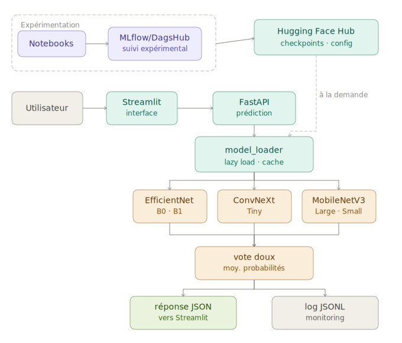

# P2 — Mise en situation professionnelle

## 1. Architecture globale du service IA

### Vue d'ensemble

Le projet **Plant Disease Detection** est un service d'aide au diagnostic foliaire par image. L'utilisateur soumet une photo de feuille ; le système identifie l'espèce végétale, puis diagnostique la maladie associée si l'espèce est couverte. La réponse inclut un score de confiance et les trois classes les plus probables pour chaque tâche.

Le service repose sur trois blocs distincts :

Pour répondre à l'énoncé de mise en situation, le « modèle fourni » correspond ici aux checkpoints Keras sélectionnés à l'issue de la phase de benchmark : 24 modèles répartis sur 8 tâches, décrits par `ensemble_config.json` et servis par l'API.

| Bloc | Technologie | Rôle |
|---|---|---|
| Interface utilisateur | Streamlit | Upload d'image, affichage des résultats, page monitoring |
| API de prédiction | FastAPI | Preprocessing, orchestration du vote doux, endpoints REST |
| Stockage des artefacts ML | Hugging Face Hub | Configuration d'ensemble et checkpoints `.keras` |

Le suivi expérimental des entraînements est assuré par **MLflow** avec le serveur distant **DagsHub**. Le monitoring du service déployé est assuré par un fichier **JSONL** local au conteneur, sans dépendance externe.

### Schéma d'architecture globale



### Flux utilisateur

1. L'utilisateur upload une image depuis Streamlit.
2. Streamlit transmet l'image à l'API via une requête HTTP `POST /predict`.
3. L'API préprocess l'image, prédit l'espèce (ou utilise celle fournie manuellement), applique un seuil de confiance, puis route vers le modèle maladie de l'espèce détectée.
4. Le résultat JSON est retourné à Streamlit, qui l'affiche à l'utilisateur.
5. L'API écrit simultanément un événement de monitoring dans le fichier JSONL.

---

## 2. Constitution du modèle fourni

Le « modèle fourni » au sens de cet énoncé correspond aux artefacts produits à l'issue des notebooks de benchmark (03 à 05).

| Étape | Rôle |
|---|---|
| `01_data_exploration.ipynb` | Exploration des données et cadrage des classes retenues |
| `02_preprocessing.ipynb` | Préparation des images et validation des transformations |
| `03_benchmark_species.ipynb` | Benchmark des modèles de reconnaissance d'espèce |
| `04_benchmark_diseases.ipynb` | Benchmark des modèles maladie par espèce |
| `05_ensemble_selection.ipynb` | Sélection finale des modèles et génération de `ensemble_config.json` |

### Ensemble de checkpoints

Le notebook 05 applique la stratégie `top3_max2_family` : elle retient les 3 modèles les plus performants par tâche tout en limitant la surreprésentation d'une même famille d'architectures. La sélection finale comprend **24 checkpoints Keras** couvrant **8 tâches** :

| Tâche | Rôle |
|---|---|
| `species` | Identification de l'espèce végétale |
| `tomato` | Diagnostic des maladies de la tomate |
| `apple` | Diagnostic des maladies du pommier |
| `grape` | Diagnostic des maladies de la vigne |
| `corn` | Diagnostic des maladies du maïs |
| `potato` | Diagnostic des maladies de la pomme de terre |
| `pepper` | Diagnostic des maladies du piment |
| `strawberry` | Diagnostic des maladies de la fraise |

### Configuration et publication des artefacts

La sélection finale est décrite dans `ensemble_config.json`, généré par le notebook 05 et publié sur Hugging Face Hub avec les 24 checkpoints via `scripts/push_models_to_hub.py`. L'API lit ce fichier à la demande pour connaître les tâches disponibles, l'ordre des classes et les chemins des modèles correspondants. En mode `hub`, les checkpoints sont récupérés depuis Hugging Face Hub puis mis en cache après chargement.

Les données d'entraînement, de validation et de test in-distribution proviennent de **PlantVillage**. **PlantDoc** est utilisé uniquement pour l'évaluation out-of-distribution et n'est jamais utilisé pour entraîner les modèles. Les performances y sont nettement plus faibles, ce qui confirme que le système constitue un prototype démontrable et non un outil de diagnostic agronomique certifié. Le détail complet des métriques est présenté dans la page *Résultats*.

---

## 3. Développement de l'API REST

### Principes de conception

L'API est conçue pour être **progressive** : elle démarre et répond sur `/health` et `/models/info` même si les modèles ne sont pas encore disponibles. Les endpoints de prédiction retournent un `503` explicite dans ce cas, ce qui permet de développer, tester et déployer l'API indépendamment de la fin des entraînements.

TensorFlow n'est importé qu'au moment du premier chargement de modèle (import tardif), ce qui préserve la réactivité du healthcheck.

### Endpoints exposés

| Méthode | Endpoint | Rôle |
|---|---|---|
| `GET` | `/health` | Vérifie que l'API est en ligne |
| `GET` | `/models/info` | Retourne l'état de la configuration, des tâches disponibles et du cache de modèles |
| `POST` | `/predict` | Prédiction complète espèce + maladie |
| `POST` | `/predict/species` | Prédiction d'espèce seule |
| `POST` | `/predict/disease` | Diagnostic maladie avec espèce fournie |
| `GET` | `/monitoring/summary` | Synthèse des événements de monitoring |

### Organisation du code API

```
src/api/
├── main.py              # Crée l'application FastAPI et branche les routeurs
├── model_loader.py      # Lecture config, chargement lazy, vote doux
├── preprocessing.py     # Conversion image uploadée → batch numpy RGB
├── schemas.py           # Contrats Pydantic
└── routers/
    ├── health.py        # GET /health
    ├── models.py        # GET /models/info
    ├── predict.py       # POST /predict, /predict/species, /predict/disease
    └── monitoring.py    # GET /monitoring/summary
```

### Gestion de l'image uploadée

L'API reçoit un `UploadFile` FastAPI. Le preprocessing lit les bytes bruts, les convertit en image PIL RGB, redimensionne à 224×224 et retourne un tableau numpy de forme `(1, 224, 224, 3)` avec des valeurs entières `0–255`. Aucune normalisation n'est appliquée côté API : les modèles Keras embarquent leur propre couche de preprocessing.

### Prédiction espèce puis maladie

L'endpoint `/predict` orchestre deux tâches :

1. **Mode automatique** (aucune espèce fournie) : l'API prédit l'espèce via l'ensemble `species`. Si la confiance est inférieure à `CONFIDENCE_THRESHOLD` (défaut `0.65`), la réponse retourne le statut `uncertain_species` et invite l'utilisateur à confirmer l'espèce.
2. **Mode manuel** (espèce fournie) : l'API considère l'espèce comme déclarée et route directement vers le modèle maladie correspondant.

```
POST /predict
  ├── species absente → predict_task("species") → confiance ≥ seuil ?
  │     ├── non  → retourne uncertain_species
  │     └── oui  → predict_task(<espèce détectée>)
  └── species fournie → predict_task(<espèce fournie>)
```

### Vote doux

Pour chaque tâche, `model_loader.py` charge les trois modèles sélectionnés par le notebook 05, calcule leurs probabilités individuelles et en fait la moyenne :

```python
probabilité_finale = np.mean([proba_1, proba_2, proba_3], axis=0)
classe_finale = np.argmax(probabilité_finale)
confiance = probabilité_finale[classe_finale]
```

Les modèles sont mis en cache mémoire via `@lru_cache` pour éviter un rechargement à chaque requête.

### Exemple simplifié de réponse JSON

```json
{
  "status": "ok",
  "species": {
    "species": "tomato",
    "confidence": 0.97,
    "source": "auto",
    "top_predictions": [
      {"label": "tomato", "confidence": 0.97},
      {"label": "pepper", "confidence": 0.02},
      {"label": "potato", "confidence": 0.01}
    ]
  },
  "disease": {
    "disease": "Late_Blight",
    "confidence": 0.91,
    "top_predictions": [
      {"label": "Late_Blight", "confidence": 0.91},
      {"label": "Early_Blight", "confidence": 0.05},
      {"label": "Healthy", "confidence": 0.02}
    ]
  },
  "action_required": null
}
```

### Documentation interactive

FastAPI génère automatiquement une interface Swagger accessible à `/docs`. Elle permet de tester chaque endpoint directement depuis le navigateur, de consulter les schémas Pydantic et de vérifier les comportements d'erreur principaux.

---

## 4. Intégration de l'API dans l'application Streamlit

### Séparation frontend / backend

Streamlit ne charge aucun modèle et ne dépend pas de TensorFlow. Il envoie uniquement des requêtes HTTP vers l'API et affiche les réponses. L'URL de l'API est configurée via la variable d'environnement `API_URL`, ce qui permet de pointer vers l'API locale en développement ou vers l'URL publique Hugging Face en production.

### Fonctionnalités de l'interface

| Fonctionnalité | Détail |
|---|---|
| Upload d'image | Sélecteur de fichier, envoi en multipart à `POST /predict` |
| Mode automatique | L'API détecte l'espèce ; Streamlit affiche le résultat ou invite à confirmer |
| Mode manuel | L'utilisateur sélectionne l'espèce dans une liste ; envoi avec le champ `species` |
| Affichage des résultats | Espèce prédite, maladie prédite, confiances, top 3 classes |
| Page Monitoring | Appel à `GET /monitoring/summary` pour afficher les métriques de service |
| Gestion des erreurs | Messages clairs si l'API retourne `503` (modèles absents) ou `400` (image invalide) |

### Accessibilité et messages utilisateur

Les réponses `uncertain_species` déclenchent un message d'avertissement visible avec un bouton de confirmation d'espèce. Les erreurs API sont interceptées et reformulées en messages compréhensibles, sans exposer les détails techniques internes.

L'interface Streamlit prend en compte un premier niveau d'accessibilité : libellés explicites, messages textuels pour les erreurs, affichage des scores sous forme numérique, mode manuel permettant de confirmer l'espèce, et absence d'information transmise uniquement par la couleur. Le projet n'a pas fait l'objet d'un audit RGAA complet ; l'objectif est ici de fournir une interface lisible et démontrable dans le cadre du prototype.

---

## 5. Packaging et déploiement

### Architecture de déploiement

| Ressource | Plateforme | URL |
|---|---|---|
| Modèles `.keras` + config | Hugging Face Hub | `huggingface.co/DredFury/plant-disease-detection-models` |
| API FastAPI | Hugging Face Space (Docker) | `dredfury-plant-disease-detection-api.hf.space` |
| Interface Streamlit | Hugging Face Space (Docker) | `dredfury-plant-disease-detection-app.hf.space` |

### Dockerfile API

Le `Dockerfile` API est conçu pour être compatible Hugging Face Spaces :

- Port d'écoute `7860` (port standard des Spaces).
- `HF_HOME=/tmp/huggingface` pour placer le cache dans un répertoire inscriptible.
- `MODEL_SOURCE=hub` en production pour récupérer la configuration et les checkpoints depuis Hugging Face Hub à la demande, puis les mettre en cache.

TensorFlow n'est chargé qu'au premier appel de prédiction ; le démarrage du conteneur reste rapide.

### Dockerfile Streamlit

Le `Dockerfile.streamlit` ne contient pas TensorFlow. Il installe uniquement les dépendances frontend nécessaires à l'interface Streamlit et lance l'application sur le port configuré. Sur Hugging Face Spaces, les protections XSRF/CORS sont désactivées dans la commande de démarrage pour permettre l'upload de fichiers depuis le navigateur.

### Variables d'environnement

**Space API (production) :**

| Variable | Valeur |
|---|---|
| `MODEL_SOURCE` | `hub` |
| `HF_REPO_ID` | `DredFury/plant-disease-detection-models` |
| `HF_TOKEN` | secret, non commité |
| `CONFIDENCE_THRESHOLD` | `0.65` |
| `MONITORING_LOG_PATH` | `/tmp/plant-disease-detection/predictions.jsonl` |

**Space Streamlit (production) :**

| Variable | Valeur |
|---|---|
| `API_URL` | `https://dredfury-plant-disease-detection-api.hf.space` |

**Local (développement) :**

| Variable | Valeur |
|---|---|
| `MODEL_SOURCE` | `local` |
| `ENSEMBLE_CONFIG_PATH` | `models/ensemble_config.json` |
| `MLFLOW_TRACKING_URI` | URI DagsHub |
| `API_URL` | `http://localhost:8000` |

Le fichier `.env` reste local et est ignoré par Git.

### Sécurité des secrets et des données

La sécurisation repose principalement sur la séparation des secrets et du code : le fichier `.env` est ignoré par Git, `HF_TOKEN` est configuré comme secret Hugging Face, et l'interface Streamlit ne connaît pas le token modèle. L'API publique ne stocke pas les images uploadées. En revanche, aucune authentification applicative par clé API ou compte utilisateur n'a été ajoutée dans ce prototype ; ce point fait partie des limites avant une exposition production réelle.

### Lancement local avec Docker Compose

Docker Compose orchestre deux services (`api` et `streamlit`) avec un réseau interne. Le dossier `models/` est monté en lecture seule dans le conteneur API pour éviter de copier les checkpoints dans l'image.

```bash
docker compose up --build
# API disponible sur http://localhost:8000
# Interface sur  http://localhost:8501
```

### Publication des modèles

Après génération de `ensemble_config.json` par le notebook 05, le script `scripts/push_models_to_hub.py` publie les 24 checkpoints sélectionnés et la configuration sur Hugging Face Hub. Une option `--dry-run` permet de vérifier la liste des fichiers avant l'envoi réel.

### Vérifications post-déploiement

```bash
# Santé de l'API
curl https://dredfury-plant-disease-detection-api.hf.space/health
# → {"status": "ok"}

# Disponibilité des modèles
curl https://dredfury-plant-disease-detection-api.hf.space/models/info
# → config_available: true, complete: true, 3 modèles par tâche
```

---

## 6. Monitoring du service IA

### Principes

Le monitoring est volontairement minimal, adapté aux contraintes d'un projet individuel sur infrastructure gratuite. À chaque appel de prédiction, l'API écrit un événement au format JSONL dans un fichier local au conteneur. L'image uploadée par l'utilisateur n'est jamais stockée.

### Champs enregistrés par événement

| Champ | Type | Description |
|---|---|---|
| `timestamp` | ISO 8601 | Horodatage de l'appel |
| `endpoint` | string | `/predict`, `/predict/species`, `/predict/disease` |
| `mode` | string | `auto` ou `manual` |
| `status` | string | `ok`, `uncertain_species`, `error` |
| `species` | string | Espèce prédite ou déclarée |
| `disease` | string | Maladie prédite (si disponible) |
| `species_confidence` | float | Score de confiance espèce |
| `disease_confidence` | float | Score de confiance maladie |
| `latency_ms` | float | Temps de réponse en millisecondes |
| `model_source` | string | `local` ou `hub` |

### Endpoint `/monitoring/summary`

L'endpoint `GET /monitoring/summary` agrège les événements JSONL et retourne :

```json
{
  "enabled": true,
  "storage": "jsonl",
  "total_predictions": 12,
  "ok": 9,
  "uncertain_species": 2,
  "errors": 1,
  "average_latency_ms": 842.41,
  "average_species_confidence": 0.81,
  "average_disease_confidence": 0.76,
  "last_event_at": "2026-04-18T10:00:00+00:00"
}
```

La page Monitoring de Streamlit appelle cet endpoint et affiche ces métriques, ce qui permet une démonstration directe de l'observabilité du service.

### Distinction MLflow / JSONL

| Outil | Périmètre | Données suivies |
|---|---|---|
| MLflow / DagsHub | Expérimentation (notebooks) | Hyperparamètres, métriques d'entraînement, runs |
| JSONL local | Service (API en production) | Statuts, confiances, latences des prédictions |

MLflow n'est pas utilisé comme plateforme de monitoring de service en production. Ces deux dispositifs sont complémentaires et couvrent des périmètres distincts.

### Limites du monitoring

Le stockage JSONL est local au conteneur. Sur Hugging Face Spaces gratuits, il peut être remis à zéro si le Space redémarre. Ce dispositif suffit pour démontrer l'observabilité du service, mais il ne remplace pas une plateforme de logs production avec alerting et persistance garantie.

---

## 7. Tests automatisés et validation

### Stratégie de test

Les tests sont conçus pour fonctionner **sans les checkpoints finaux**. Ils valident le code de l'application sans dépendre du résultat des entraînements, ce qui permet de les exécuter en CI sur des runners sans GPU.

### Couverture des tests

| Domaine | Ce qui est testé |
|---|---|
| Healthcheck | Réponse `{"status": "ok"}` sur `GET /health` |
| Configuration modèles | `/models/info` avec et sans `ensemble_config.json` |
| Disponibilité des modèles | Erreur `503` explicite si config absente ou tâche manquante |
| Preprocessing | Conversion bytes → batch numpy `(1, 224, 224, 3)`, rejet d'images invalides |
| Vote doux | Résultat correct avec modèles factices (numpy stubs) |
| `model_loader` | Résolution des chemins locaux et Docker, validation de la structure config |
| Monitoring tracker | Écriture et lecture du fichier JSONL, calcul des agrégats |
| Configuration MLflow | Présence et format des variables d'environnement |
| Données | Organisation des splits, alignement classes/images |

### Lancement des tests

```bash
make test
# ou
python -m pytest
python -m coverage report --fail-under=70
```

Le seuil minimal de couverture est fixé à **70 %**. Toute régression bloque la CI.

Les tests ne rejouent pas l'évaluation complète des modèles finaux, car celle-ci dépend de checkpoints volumineux et d'un temps de calcul important. Les performances sont validées dans les notebooks, tandis que la CI garantit la non-régression du code de mise en service.

---

## 8. Chaîne CI/CD et approche MLOps

### Pipeline GitHub Actions

La CI est déclenchée sur chaque push vers `main` ou `develop`, sur chaque pull request, et en lancement manuel (`workflow_dispatch`).

```
push GitHub
    │
    ▼
┌─────────────────────────────────┐
│  Job: test                      │
│  1. Setup Python 3.11           │
│  2. pip install (CPU, dev)      │
│  3. py_compile entrypoints      │
│  4. pytest                      │
│  5. coverage ≥ 70 %             │
│  6. mkdocs build --strict       │
└────────────────┬────────────────┘
                 │ succès + (main ou manual)
                 ▼
┌─────────────────────────────────┐
│  Job: docker-api                │
│  docker build -t api:ci .       │
└─────────────────────────────────┘
```

### Détail des étapes CI

| Étape | Outil | Objectif |
|---|---|---|
| Installation | `pip` + `requirements-cpu.txt` | Dépendances sans GPU pour la CI |
| Compilation | `py_compile` | Détecte les erreurs de syntaxe sans exécuter |
| Tests | `pytest` | Valide le comportement de l'application |
| Coverage | `coverage report` | Garantit un niveau de qualité minimal |
| Documentation | `mkdocs build --strict` | Vérifie que la doc se construit sans erreur |
| Build Docker | `docker build` | Valide le Dockerfile API sur `main` |

### Publication des modèles

La publication des modèles sur Hugging Face Hub est effectuée manuellement via `scripts/push_models_to_hub.py` après la fin du notebook 05. Cette étape n'est pas automatisée dans la CI car elle dépend d'entraînements longs (notebooks 03 et 04) et de fichiers volumineux qui ne doivent pas transiter par Git.

### Limites de la chaîne CI/CD

La chaîne mise en place est une **CI/CD partielle** : elle automatise la validation du code, les tests, la génération de la documentation et le build Docker. Le déploiement des Spaces reste déclenché par un push Git vers les dépôts Hugging Face dédiés. Dans un projet plus mature, cette étape pourrait être automatisée via l'API Hugging Face ou un webhook.

---

## 9. Démonstration du système complet

### Scénario de démonstration

| Étape | Action | Ce que cela démontre |
|---|---|---|
| 1 | Ouvrir l'interface Streamlit | L'application est déployée et accessible publiquement |
| 2 | Uploader une image de feuille | L'upload fonctionne, la requête atteint l'API |
| 3 | Observer espèce + maladie + confiances + top 3 | La chaîne complète de prédiction fonctionne de bout en bout |
| 4 | Tester le mode manuel (sélectionner une espèce) | Le routage direct vers le modèle maladie fonctionne |
| 5 | Ouvrir `/docs` sur l'API | La documentation Swagger est auto-générée et utilisable |
| 6 | Tester `GET /health` et `GET /models/info` | L'API est en ligne, la configuration est complète, les 24 checkpoints attendus sont référencés, et le cache indique les modèles déjà chargés en mémoire |
| 7 | Consulter `GET /monitoring/summary` | Les prédictions sont tracées ; latence et confiances sont visibles |
| 8 | Afficher la page Monitoring dans Streamlit | L'intégration frontend/monitoring fonctionne |
| 9 | Ouvrir GitHub Actions | La CI passe ; tests, coverage, docs et Docker sont validés |
| 10 | Ouvrir le repo Hugging Face Hub | Les 24 checkpoints et `ensemble_config.json` sont publiés |

---

## 10. Limites de la mise en service

| Limite | Description |
|---|---|
| Dataset contrôlé | PlantVillage contient des images propres, bien cadrées et homogènes. Les performances in-distribution sont très élevées mais peuvent surestimer la robustesse réelle. |
| Évaluation OOD partielle | PlantDoc est utilisé uniquement comme diagnostic de robustesse. Il ne couvre pas toutes les classes de façon uniforme et ne valide pas la robustesse en conditions terrain. |
| Absence de validation métier | L'application n'a pas été évaluée par des experts agricoles. Les prédictions ne constituent pas un avis agronomique. |
| Confiance non calibrée | Les scores de confiance reflètent les probabilités du softmax mais ne sont pas calibrés. Une confiance élevée ne garantit pas un diagnostic correct. |
| Cold start Hugging Face | Les Spaces gratuits peuvent s'endormir après inactivité. Le premier appel peut également déclencher le lazy loading des 24 modèles, ce qui allonge la latence initiale. |
| Monitoring minimal | Le stockage JSONL est local au conteneur et éphémère. Il n'y a pas d'alerting, pas de persistance garantie ni de tableau de bord dédié. |
| Pas de réentraînement automatique | La chaîne CI/CD valide le code et l'image Docker, mais ne déclenche pas de réentraînement ni de mise à jour automatique des modèles en production. |

---

## 11. Conclusion de la Partie 2

La Partie 2 du projet démontre la mise en service complète d'un système de diagnostic foliaire par image, s'appuyant sur un ensemble de 24 checkpoints Keras répartis sur 8 tâches et sélectionnés par la stratégie `top3_max2_family` à l'issue du benchmark.

L'**API REST FastAPI** expose six endpoints documentés, gère le preprocessing des images, orchestre le vote doux entre trois modèles par tâche, applique un seuil de confiance configurable et retourne des réponses JSON structurées. Elle est conçue pour démarrer sans les modèles et signaler explicitement leur absence.

L'**interface Streamlit** intègre l'API sans embarquer TensorFlow, en mode automatique ou manuel, et expose une page de monitoring léger du service.

Le **packaging Docker** sépare frontend et backend dans deux conteneurs indépendants, compatibles Hugging Face Spaces. Les artefacts ML sont versionnés sur Hugging Face Hub ; l'API récupère la configuration et les checkpoints à la demande, puis met les modèles chargés en cache mémoire.

Le **monitoring JSONL** trace les statuts, confiances et latences de chaque prédiction et les expose via un endpoint dédié, ce qui rend le comportement du service observable sans infrastructure supplémentaire.

Les **tests automatisés** couvrent les composants critiques sans dépendre des checkpoints finaux, avec un seuil de couverture à 70 %. La **CI GitHub Actions** valide le code, la documentation et les tests à chaque push, et valide aussi la construction de l'image Docker sur `main` ou en lancement manuel.

L'ensemble constitue une mise en service fonctionnelle, déployée publiquement et techniquement défendable, réalisée seul dans les contraintes d'un projet de certification individuel.
